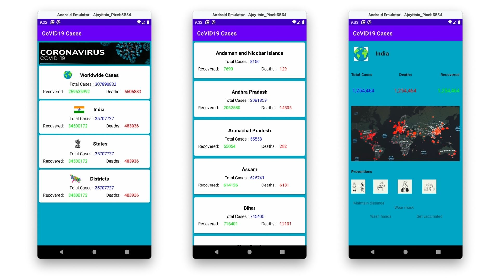

# Android-Study-Jams
- author [Umesh Singh](https://github.com/Umesh-01)
CoVID19 Cases App

<b> Problem Statement: </b>

Coronavirus disease (COVID-19) is an infectious disease caused by a newly discovered novel coronavirus which becomes dangerous to all the life present on the planet, humans as well as animals. There is no official medicines available to fight this deadly disease. Due to corona virus the whole world stoped down and it become necessary for us to proove our unity and humanity by defeating this disease wholly. And by knowledge it become easiler to understand all others and to follow intelligent steps.

<b> Proposed Solution : </b>

This project proposes a “Covid19 Cases Tracking” to keep track of the corona infected cases in different scopes. The aim of this project is to create an app that can show the user how many covid cases are currently there in the country and state.
A simple app in which the live data is being fetched from an API. Showing the data in a list view or recycler view by fetching all the data from the API.

    	  	
<b> Functionality & Concepts used : </b>

- The App has a very simple and interactive interface which helps the students select their the country and state. Following are few android concepts used to achieve the functionalities in app : 
- Constraint Layout : Most of the activities in the app uses a flexible constraint layout, which is easy to handle for different screen sizes.
- Simple & Easy Views Design : Use of familiar audience EditText with hints and interactive buttons made it easier for students to register or sign in without providing any detailed instructions pages. Apps also uses App Navigation to switch between different screens.
- RecyclerView : To present the list of different Covid Cases Cards we used the efficient recyclerview.
- Network Request and Data fetching using API : Open sourced API is used to fetch the data of covid cases of different regions, further data is deserialized and displayed on the UI.

<b> Application Link & Future Scope : </b>

The app is currently in the Alpha testing phase with Chandigarh University with a limited no. of users, You can access the app : [CoVID19 Cases App](https://drive.google.com/file/d/1PkrF1fuf5lrJOqRHN0zNzNZTzhLTEyNf/view?usp=sharing).

Once the app is fully tested and functional in Chandigarh University, we are planning to extend this application to feature with contact notification using Bluthooth and Location Based services using blockchains.
